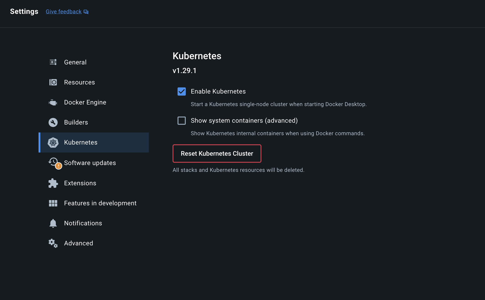

# Getting Started

## 1. First Time

1. Ensure all dependencies are installed - 
```bash
make setup-deps
```

2. Ensure Kubernetes is enabled in Docker

</img>

3. If on Mac silicon, ensure Rosetta emulation is enabled.

4. Install Hermes, ensure it's in PATH (separate from Starship, but necessary for this demo)

```bash
# assumes rust is installed
cargo install ibc-relayer-cli --bin hermes --locked

# confirm hermes is installed
hermes version
> hermes v1.8.0+39036d1
```
[More detailed hermes install instructions](https://hermes.informal.systems/quick-start/installation.html#install-via-cargo)


## 2. Start Starship Service
```bash
# start the service with helm
helm install -f configs/starship.yaml starship-getting-started starship/devnet --version 0.1.48
```

```bash
# ensure the pods started
watch kubectl get pods
```

```bash
# forward ports
make port-forward
```

## 3. Start Agoric Chain

```bash
cd ~/agoric-sdk/packages/cosmic-swingset
make scenario2-setup scenario2-run-chain
```

## 4. Fund Relayer
```bash
cd ~/agoric-sdk/packages/cosmic-swingset
make ACCT_ADDR=agoric1gtkg0g6x8lqc734ht3qe2sdkrfugpdp2h7fuu0 FUNDS=2000000ubld fund-acct
```

## 5. Add keys to hermes
```bash
hermes keys add --chain agoriclocal --mnemonic-file keys/user-1.key
hermes keys add --chain osmosis-test --mnemonic-file keys/osmosis-1.key
```

## 6. Add clients, connection, and start Hermes
```bash
# create clients
hermes --config ./config.toml create client --host-chain agoriclocal --reference-chain osmosis-test
hermes --config ./config.toml create client --host-chain osmosis-test --reference-chain agoriclocal
# create connection between them
hermes --config ./config.toml create connection --a-chain agoriclocal --b-chain osmosis-test
# when successful, start client
hermes --config ./config.toml start
```

<details>
  <summary>Example Output</summary>

  ```bash
  $ hermes --config ./config.toml create client --host-chain agoriclocal --reference-chain osmosis-test
  SUCCESS CreateClient(
      CreateClient(
          Attributes {
              client_id: ClientId(
                  "07-tendermint-0",
              ),
              client_type: Tendermint,
              consensus_height: Height {
                  revision: 0,
                  height: 148,
              },
          },
      ),
  )
  ```
  ```bash
  $ hermes --config ./config.toml create client --host-chain osmosis-test --reference-chain agoriclocal
  SUCCESS CreateClient(
      CreateClient(
          Attributes {
              client_id: ClientId(
                  "07-tendermint-1",
              ),
              client_type: Tendermint,
              consensus_height: Height {
                  revision: 0,
                  height: 27,
              },
          },
      ),
  )
  ```
  ```bash
  $ hermes create connection --a-chain agoriclocal --b-chain osmosis-test
  INFO ThreadId(01) 🥂 agoriclocal => OpenInitConnection(OpenInit { Attributes { connection_id: connection-0, client_id: 07-tendermint-1, counterparty_connection_id: None, counterparty_client_id: 07-tendermint-2 } }) at height 0-30
  INFO ThreadId(01) 🥂 osmosis-test => OpenTryConnection(OpenTry { Attributes { connection_id: connection-1, client_id: 07-tendermint-2, counterparty_connection_id: connection-0, counterparty_client_id: 07-tendermint-1 } }) at height 0-185
  INFO ThreadId(01) 🥂 agoriclocal => OpenAckConnection(OpenAck { Attributes { connection_id: connection-0, client_id: 07-tendermint-1, counterparty_connection_id: connection-1, counterparty_client_id: 07-tendermint-2 } }) at height 0-34
  INFO ThreadId(01) 🥂 osmosis-test => OpenConfirmConnection(OpenConfirm { Attributes { connection_id: connection-1, client_id: 07-tendermint-2, counterparty_connection_id: connection-0, counterparty_client_id: 07-tendermint-1 } }) at height 0-203
  INFO ThreadId(01) connection handshake already finished for Connection { delay_period: 0ns, a_side: ConnectionSide { chain: BaseChainHandle { chain_id: agoriclocal }, client_id: 07-tendermint-1, connection_id: connection-0 }, b_side: ConnectionSide { chain: BaseChainHandle { chain_id: osmosis-test }, client_id: 07-tendermint-2, connection_id: connection-1 } }
  SUCCESS Connection {
      delay_period: 0ns,
      a_side: ConnectionSide {
          chain: BaseChainHandle {
              chain_id: ChainId {
                  id: "agoriclocal",
                  version: 0,
              },
              runtime_sender: Sender { .. },
          },
          client_id: ClientId(
              "07-tendermint-1",
          ),
          connection_id: Some(
              ConnectionId(
                  "connection-0", // controllerConnectionId
              ),
          ),
      },
      b_side: ConnectionSide {
          chain: BaseChainHandle {
              chain_id: ChainId {
                  id: "osmosis-test",
                  version: 0,
              },
              runtime_sender: Sender { .. },
          },
          client_id: ClientId(
              "07-tendermint-2",
          ),
          connection_id: Some(
              ConnectionId(
                  "connection-1", // hostConnectionId
              ),
          ),
      },
  }
  ```
</details>

## 7. Start ag-solo + REPL 
```bash
cd ~/agoric-sdk/packages/cosmic-swingset
make scenario2-run-client
```

## 8. Create Account in REPL
```bash
agoric open --repl

# in REPL:
E(home.agoricNames).lookup('instance', 'stakeAtom')
E(home.zoe).getPublicFacet(history[n])
pf = history[n]
E(pf).providePort()
E(pf).provideAccount('main', 'connection-1', 'connection-0')
```


## Stop Starship Service
```bash
helm delete starship-getting-started
make stop-forward

# or, in one step:
make stop
```
